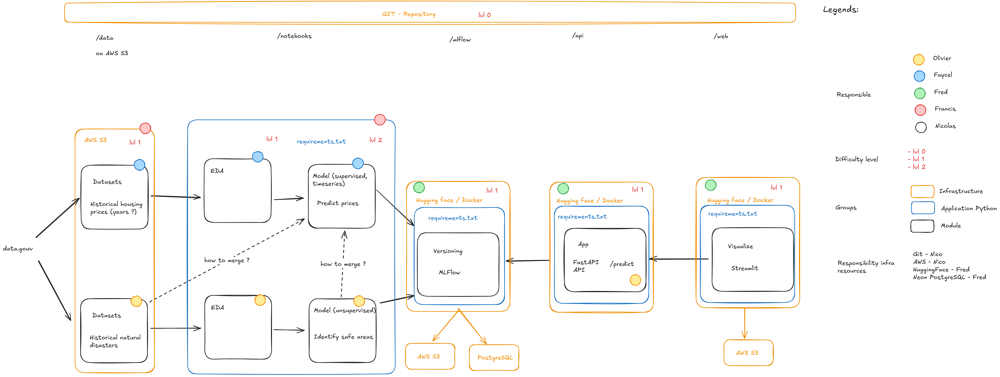

# Architecture Design

This document outlines the high-level architecture design for the project, detailing the components and their interactions.

## Components

### 1. Frontend (Streamlit)
- **Description**: The user interface of the application, built with Streamlit.
- **Responsibilities**:
  - Displaying data visualizations and user inputs.
  - Interacting with the backend to fetch and display data.
- **Technologies**: Streamlit, Python.

### 2. Backend (FastAPI)
- **Description**: The server-side application, built with FastAPI.
- **Responsibilities**:
  - Handling API requests from the frontend.
  - Processing data and business logic.
  - Interacting with the database.
- **Technologies**: FastAPI.

### 3. MLFlow
- **Description**: A platform for managing the machine learning lifecycle.
- **Responsibilities**:
  - Tracking experiments and model versions.
  - Storing model artifacts and metadata.
- **Technologies**: MLFlow server, PostgreSQL (for tracking).

### 4. EDA (Exploratory Data Analysis and Visualization), models, and data
- **Description**: The data processing and analysis components.
- **Responsibilities**:
  - Performing exploratory data analysis.
  - Training and evaluating machine learning models.
  - Storing and retrieving datasets.
- **Technologies**: Python, Pandas, Scikit-learn, Plotly, Pytorch, Prophet, etc.
