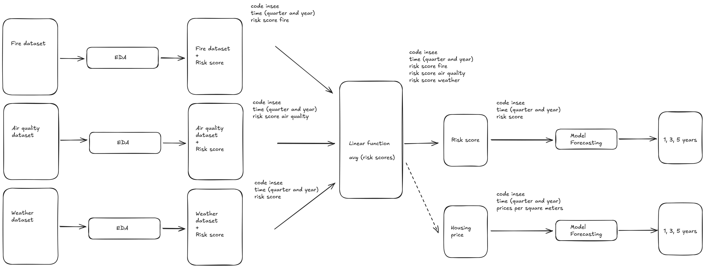

# Data Pipeline

This document outlines the data pipeline architecture for the project, detailing the components and their interactions.

## Safe Zones

The safe zones are defined by insee codes, which are unique identifiers for geographical areas in France. The safe zones are used to filter and process data relevant to specific regions.

### Generate a risk score for each risk

#### Fire datasets

- **Source**: Fire datasets are collected from various sources, including government agencies and satellite imagery
- **Storage**: The datasets are stored in a secure cloud storage solution, ensuring data integrity and availability.

#### Air Quality datasets

- **Source**: Air quality datasets are sourced from environmental monitoring stations and IoT devices.
- **Storage**: These datasets are also stored in the secure cloud storage solution, allowing for easy access and processing.

#### Weather datasets

- **Source**: Weather datasets are obtained from meteorological services and online APIs.
- **Storage**: Similar to the other datasets, weather data is stored in the secure cloud storage solution.

### Generate a global risk score

#### Risk score calculation

- **Process**: The risk score is calculated averaging the individual risk scores from fire, air quality, and weather datasets.
- **Output**: The output is a global risk score that indicates the overall risk level for the area being monitored.
